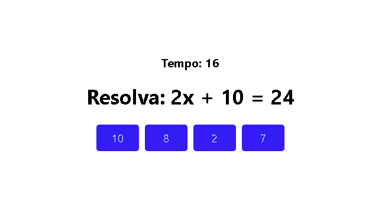

# Grupo2-DevMob

**Um jogo para estudar matemática e se divertir**


Este jogo foi criado para o processo seletivo da DevMob em 2021.1 e todo código fonte é de acesso livre.

---
## Pré-requisitos para rodar o sistema
Para rodar o sistema será necessário instalar o [node](https://nodejs.org/en/ "Clique e veja como baixar o node") e o [Expo](https://docs.expo.io/ "Clique e veja como baixar o Expo").
## Rodando o projeto
````git
$ git clone https://github.com/sidneyouteiro/Grupo2-DevMob.git
$ cd Grupo2-DevMob
$ npm install
````
**Neste momento app já deve estar pronto para rodar**
````git
$ expo start --web
````